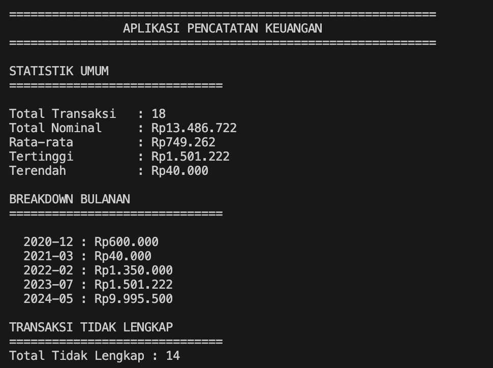

<h1 align="center">Tugas Makalah IF2211 Strategi Algoritma

</h1>
<h2  align="center">Penerapan Algoritma String Matching dan Regular Expression pada Bukti Transaksi Digital untuk Otomatisasi Pencatatan Keuangan</h2>

<p align="center">
  
</p>

Repositori ini berisi program implementasi makalah IF2211 Strategi Algoritma dengan judul Penerapan Algoritma String Matching dan Regular Expression pada Bukti Transaksi Digital untuk Otomatisasi Pencatatan Keuangan oleh Alfian Hanif Fitria Yustanto

## Fitur

- Ekstraksi teks dari gambar dan PDF menggunakan OCR.
- Deteksi otomatis nominal, tanggal, dan tujuan transaksi dengan regular expression.
- Analisis transaksi per bulan, total pengeluaran, rata-rata.

## Stack

- Python 3
- OCR: `pytesseract` + `Pillow`
- PDF Parsing: `PyMuPDF` (fitz)
- String matching dan regex: `re` bawaan Python

## Struktur Proyek

```
.
├── adapter/
│ ├── ImageAdapter.py
│ └── PDFAdapter.py
├── extractor/
│ └── extractor.py
├── model/
│ └── Transaksi.py
├── repository/
│ └── TransaksiRepository.py
├── data/
│ └── (PDF dan gambar transaksi)
├── main.py
├── requirements.txt
└── README.md

```

## Instalasi & Menjalankan Aplikasi

### 1. Clone repositori ini

```bash
git clone https://github.com/AlfianHanifFY/Pencatatan_Keuangan.git
cd pencatatan_keuangan
```

### 2. Buat virtual environment

```bash
python -m venv venv
```

### 3. Aktifkan virtual environment

- **Windows:**

  ```bash
  venv\Scripts\activate
  ```

- **macOS/Linux:**

  ```bash
  source venv/bin/activate
  ```

### 4. Install dependensi

```bash
pip install -r requirements.txt
```

### 5. Jalankan aplikasi

```bash
python main.py
```

## 📦 Daftar Dependensi (requirements.txt)

```
pytesseract
Pillow
PyMuPDF
```

## Menyiapkan data

Letakkan file bukti transaksi dalam bentuk **PDF** atau **Gambar (.jpg/.png)** di dalam folder `data/`.

## Makalah

Judul: _Penerapan Algoritma String Matching dan Regular Expression pada Bukti Transaksi Digital untuk Otomatisasi Pencatatan Keuangan_

| Nama   | NIM      | Email                                                               | Tahun |
| ------ | -------- | ------------------------------------------------------------------- | ----- |
| Alfian | 13523073 | [13523073@mahasiswa.itb.ac.id](mailto:13523073@mahasiswa.itb.ac.id) | 2025  |

# Pencatatan_Keuangan
